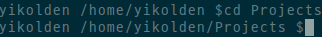

## 목차
1. 쉘 기본 로직 구현
    1. 명령어 Parser 구현
    2. 내부 명령어 실행 구현
    3. 외부 명령어 실행 구현
    4. Background 실행 구현
    5. Redirection 구현
    6. Pipe 구현
2. mysh 시연 & 디버깅 스냅샷
3. 논의
4. Github


<br/><br/><br/><br/>

## 1. 쉘 기본 로직 구현  
간략한 보고서를 위해 유틸리티 함수들의 구현 설명은 최소화 하였습니다.

### 1.1 명령어 Parser 구현  
```c
// tokenizer.h :7
typedef struct file {
    char* filepath;
    int flags;
    mode_t mode;
} File;
```
Redirection시 파일을 open 해야합니다.  
따라서 각 모드나 플래그에 따라 편하게 관리하기 위해 File 구조체를 정의합니다.  
```c
// tokenizer.h :14
typedef struct command {
    char* command; // 명령어
    char** flags; // 인자값
    int flagsSize; // 인자의 개수
    File* inputRedirectionFiles;  // '<' redirection 파일 목록
    int inputRedirectionCount;
    File* outputRedirectionFiles; // '>' or '>>' redirection 파일 목록
    int outputRedirectionCount;
} Command;
```
각 명령어마다 이름, 인자, redirection 정보들이 필요하기에 해당 정보들을 담을 수 있는 구조체를 선언했습니다.  
```c
// tokenizer.h :28
typedef struct command_pool {
    Command** commandPool;
    int capacity;
    int size;
    int curPos;
    bool background;
} CommandPool;
```
파이프(`|`)를 통해 다수의 명령어가 동시에 실행될 수 있기 때문에 다수의 명령어를 관리하는 CommandPool 구조체를 선언했습니다.  
명령어 구조체 뿐만 아니라 background 실행 여부도 저장합니다.  
```c
// tokenizer.c :228
#include <string.h>
#include <memory.h>
...
char** tmpPipeTokens = (char**)malloc(sizeof(char*) * commandPool->capacity);
for (char* pipeToken = strtok(lineClone, "|") ; pipeToken != NULL ; pipeToken = strtok(NULL, "|")) {
    Command* newCommand = (Command*)malloc(sizeof(Command));
    InitalizeCommand(newCommand);
    ...
}
```
C 언어의 표준 string 라이브러리 중 토큰별로 문자열을 분리하는 **strtok** 함수를 사용하여 토큰별로 문자들을 분리했습니다.  
파이프(`|`)로 연결된 명령어들을 분리하여 각 명령어별로 새로운 Command 구조체를 생성하여 CommandPool에 삽입했습니다.

```c
// tokenizer.c :248
#include <stdbool.h>
...
char* commandToken = NULL;
bool redirectTo = false;
bool redirectBy = false;
bool appendMode = false;

for (commandToken = strtok(tmpPipeTokens[tokenIdx], " ") ; commandToken != NULL ; commandToken = strtok(NULL, " ")) {
    ...
}
```
파이프(`|`) 단위로 분리된 명령어들은 다시 공백단위로 토큰을 분리했습니다.  
그리고 공백단위로 분리 할 때 나타나는 토큰 중 redirection의 경우 상태를 저장해 다음 반복문에서 처리를 해야하기에 상태 변수를 선언합니다.

```c
// tokenizer.c :288
if (strcmp(commandToken, ">") == 0) {
    redirectTo = true;
} else if (strcmp(commandToken, "<") == 0) {
    redirectBy = true;
} else if(strcmp(commandToken, ">>") == 0) {
    redirectTo = true;
    appendMode = true;
} else if(strcmp(commandToken, "&") == 0) {
    commandPool->background = true;
}
```
Redirection 토큰, Background 토큰은 명령어가 아닌 특정 행동을 수행하는 토큰이므로 다음 반복문에서 특정 행동을 수행할 수 있도록 플래그를 설정합니다.

```c
// tokenizer.c :307
else {
    if (curCommand->command == NULL) {
        SetCommand(curCommand, commandToken);
    } else {
        PushArgument(curCommand, commandToken);
    }
}
```
만약 특수 토큰이 아니라면 명령어 또는 인자값입니다.  
아직 현재 명령어 구조체에 명령어가 설정되지 않았다면 명령어로 삽입, 아니라면 인자값으로 삽입합니다.  

```c
// tokenizer.c :261
if (redirectTo) {
    flags |= O_WRONLY;
    if (appendMode) {
        flags |= O_APPEND;
        appendMode = false;
    }

    InsertOutputRedirectionFile(curCommand, commandToken, flags, mode);
    redirectTo = false;

    continue;
}
```
만약 redirectTo(**>** or **>>** redirection 상태 값)이 true라면 이번에 오는 토큰 값은 파일 이름이 됩니다. 
redirectTo 상태이면 표준 출력 스트림을 해당 파일로 재지정해주어야 합니다.  
파일 플래그에 *O_WRONLY (Write Only)* 을 지정해주고 만약 **>>** 라면 *O_APPEND (Append)* 까지 추가 지정해줍니다.  

```c
// tokenizer.c :277
else if (redirectBy) {   
    flags |= O_RDONLY;
    InsertInputRedirectionFile(curCommand, commandToken, flags, mode);
    redirectBy = false;

    continue;
}
```
만약 redirectBy(**<** redirection 상태 값)이 true라면 이번에 오는 토큰 값은 파일 이름이 됩니다. 
redirectBy 상태이면 표준 입력 스트림을 해당 파일로 재지정해주어야 합니다.  
파일 플래그에 *O_RDONLY (Read Only)* 을 지정해주었습니다.  

### 1.2 내부 명령어 실행 구현
```c
// main.c :28
...
for(int i = 0 ; i < commandPool->size ; i++) {
    ...
    Command* curCommand = commandPool->commandPool[i];
    const char* command = curCommand->command;
    ...
}
```
명령어의 parsing이 끝났다면 CommandPool 구조체에는 모든 명령어(Command)의 정보가 담기게 됩니다.  
각 명령어들을 순차적으로 실행하기 위해 반복문을 실행합니다.    

```c
// main.c :35
...
bool runBackground = commandPool->background;
bool isInternalCommand = IsInternalCommand(command);
...
```
현재 실행해야 하는 명령어가 background 실행인지, 내부 명령어인지 확인합니다.

```c
// main.c :45
if (runBackground || !isInternalCommand) {
    pid = fork();
}
```
만약 background 실행 또는 외부 명령어라면 무조건 새로운 프로세스를 생성합니다.  
하지만 내부 명령어 실행이라면 현재 프로세스에서 진행하게됩니다.

```c
// main.c :111
...
if (isInternalCommand) {
    if (!RunInternalCommand(curCommand)) {
        fprintf(stderr, "Failed to run internal command\n");
    }
}
...
```
내부 명령어라면 해당하는 내부 명령어 실행을 위해 **RunInternalCommand* 헬퍼 함수로 현재 실행하는 명령어를 넘깁니다.

```c
// internal_command.c :8
char* INTERNAL_COMMAND[] = {
    "help", "cd", "pwd", "date", "whoami"
};
```
다른 함수, 파일에서도 접근할 수 있도록 내부 명령어들을 전역 문자열 배열에 미리 선언해두었습니다.  

```c
// internal_command.c :31
if (strcmp(commandStr, "help") == 0) {
    return Help();
} else if(strcmp(commandStr, "cd") == 0) {
    return ChangeDirectory(command);
} else if(strcmp(commandStr, "pwd") == 0) {
    return PWD();
} else if(strcmp(commandStr, "date") == 0) {
    return Date();
} else if(strcmp(commandStr, "whoami") == 0) {
    return WhoamI();
}
```
현재 들어온 명령어의 문자열이 내부 명령어에 있다면 미리 선언해둔 내부 함수를 실행합니다.

```c
// internal_command.c :59
bool Help() {
    printf("=== help commands ===\n");
    printf("help : print internal commands\n");
    printf("cd : change directory\n");
    printf("ls : list directory\n");
    printf("pwd : current password\n");
    printf("date : print current date\n");
    printf("whoami : print current user\n");
    printf("=== ============= ===\n");
    return true;
}
```
help 명령어의 내부 구현

```c
// internal_command.c :73
bool ChangeDirectory(Command* command) {
    if (command->flagsSize == 0) return true;
    if (chdir(command->flags[0]) < 0) {
        fprintf(stderr, "Failed to change directory with errno : %d\n", errno);
        return false;
    }
    return true;
}
```
cd 명령어의 내부 구현

```c
// internal_command.c :87
bool PWD() {
    char cwd[PATH_MAX] = {0};
    if (getcwd(cwd, PATH_MAX) == NULL) {
        fprintf(stderr, "Failed to find current folder with errno : %d\n", errno);
        return false;
    }
    printf("%s\n", cwd);
    return true;
}
```
pwd 명령어의 내부 구현

```c
// internal_command.c :102
bool Date() {
    time_t t = time(NULL);
    struct tm tm = *localtime(&t);
    printf("현재 시각 : %d-%02d-%02d %02d:%02d:%02d\n", tm.tm_year + 1900, tm.tm_mon + 1, tm.tm_mday, tm.tm_hour, tm.tm_min, tm.tm_sec);
    return true;
}
```
date 명령어의 내부 구현

```c
// internal_command.c :111
bool WhoamI() {
    printf("현재 유저 : %s\n", getlogin());
    return true;
}
```
whoami 명령어의 내부 구현

### 1.3 외부 명령어 실행 구현  
```c
// main.c :45
if (runBackground || !isInternalCommand) {
    pid = fork();
}
```
다시 반복분의 첫 부분으로 돌아가서, 이번엔 외부 명령어이므로 새로운 프로세스를 생성합니다.  

```c
// main.c :111
if (isInternalCommand) {
    ...
}
else if (command != NULL) {
    ...
}
```
내부 명령어 파트에서 명령어를 실행하기전 isInternalCommnad 변수를 확인했으나, 이번에는 외부 명령어이므로 해당 변수는 false이며, else if 부분이 실행됩니다.  

```c
// main.c :118
else if (command != NULL) {
    char** args = (char**)malloc(sizeof(char*) * (curCommand->flagsSize + 2));

    args[0] = (char*)command;
    for (int i = 0 ; i < curCommand->flagsSize ; i++)
    {
        args[i + 1] = curCommand->flags[i];
    }
    args[curCommand->flagsSize + 1] = NULL;

    execvp(command, args);
    fprintf(stderr, "Failed run command with errno : %d\n", errno);
}
```
외부 명령어 실행을 위해 **execvp** 함수를 사용했습니다.  
인자 값을 vector로 넘겨주기 위해 0번째에는 실행 명령어의 이름, 1~n 번째에는 사용자가 입력한 인자값, n + 1번째에는 규칙에 맞게 NULL 값을 삽입해주었습니다.

### 1.4 Background 실행 구현  
```c
// main.c :147
...
if (pid == 0) {
    exit(EXIT_SUCCESS);
} else {
    if (commandPool->background) {
        /** code **/
    } else {
        int status = -1;
        wait(&status);
    }
}
```
자식 프로세스에서 내부 명령어를 실행한 것이라면 반복문의 끝 까지 오게 됩니다. 이런 경우는 자식 프로세스에서는 exit 함수를 사용해 해당 프로세스를 종료합니다.  
일반적으로 부모 프로세스는 자식 프로세스가 끝날 때 까지 **wait**하게 됩니다.  
하지만 명령어에 *& (background)* 가 포함된 경우 **wait** 하지 않고 즉시 반복문을 넘어가 다음 명령어를 입력받도록 합니다.   

### 1.5 Redirection 구현  
```c
// main.c :24
int savedStdin = dup(STDIN_FILENO);
int savedStdout = dup(STDOUT_FILENO);
int savedStderr = dup(STDERR_FILENO);
```
Redirection을 하게 되면 기존의 stdout, stdin, stderr을 재지정해야 합니다.  
dup2를 통해 file descriptor를 복제한 후 다시 dup2로 본래의 표준 입출력으로 되돌리려면 문제가 발생하므로 dup 함수를 이용해 표준 입출력의 file descriptor를 하나씩 복제합니다. 

```c
// main.c :90
for (int i = 0 ; i < curCommand->outputRedirectionCount ; i++) {
    int fd = OpenFile(&curCommand->outputRedirectionFiles[i]);
    if (fd < 0) {
        failed = true;
        break;
    }
    if (dup2(fd, STDOUT_FILENO) < 0) {
        failed = true;
        fprintf(stderr, "Failed to direction with errno : %d\n", errno);
        break;
    }
    close(fd);
}
```
명령어를 실행하는 반복문의 내부 입니다. 명령어를 실행하기 전에 입출력 redirection을 시행합니다.  
명령어 구조체에 저장된 파일 이름들을 다 열어서 표준 출력에 **dup2** 함수를 이용해 redirection 합니다.  
redirection이 되었으므로 파일은 닫아줍니다.

```c
// main.c :71
...
for (int i = 0 ; i < curCommand->inputRedirectionCount ; i++) {
    int fd = OpenFile(&curCommand->inputRedirectionFiles[i]);
    if (fd < 0) {
        failed = true;
        break;
    }
    if (dup2(fd, STDIN_FILENO) < 0) {
        failed = true;
        fprintf(stderr, "Failed to direction with errno : %d\n", errno);
        break;
    }
    close(fd);
}
```
입력 redirection 또한 명령어 구조체에 저장된 파일들을 모두 다 열어 표준 입력 스트림에 redirection 합니다.  
열었던 file descriptor을 사용하지 않으므로 닫습니다.  


```c
// main.c :137
dup2(savedStdin, STDIN_FILENO);
dup2(savedStdout, STDOUT_FILENO);
dup2(savedStderr, STDERR_FILENO);
```
만약 부모 프로세스에서 redirection이 된 후 다음 행동을 하려 한다면 터미널에는 아무런 출력이 나타나지 않게 됩니다.  
기존의 표준 출력을 특정 파일로 redirection 했기 때문입니다.  
때문에 위에서 redirection 하기 전 복제한 표준 입출력의 file descriptor를 이용해 다시 표준 입출력에 정상적으로 출력될 수 있도록 복구 합니다.   

### 1.6 Pipe 구현  
```c
// main.c :21
int prevInput = STDIN_FILENO;
int pipeDesc[2] = { 1 };
```
파이프의 경우 각 명령어간 파이프로 연결되어야 합니다.  
따라서 이전 파이프의 출력과 입력이 연결되어야 하기에 위 변수들을 반복문 밖에 선언하였습니다.  

```c
// main.c :40
if (commandPool->size > 1) {
    pipe(pipeDesc);
}
```
만약 명령어가 2개 이상이라면 여러 명령어가 파이프(`|`)로 연결되어 입력되었있습니다.
따라서 각 명령어 프로세스간 입출력을 파이프로 연결시키기 위해 새로운 파이프를 생성합니다.  

```c
// main.c :57
if (commandPool->size > 1) {
    if (prevInput != STDIN_FILENO) {
        dup2(prevInput, 0);
        close(prevInput);
    }
    if (pipeDesc[1] != STDOUT_FILENO && i != (commandPool->size - 1)) {
        dup2(pipeDesc[1], STDOUT_FILENO);
        close(pipeDesc[1]);
    }
}
```
이전 프로세스의 파이프 출력인 prevInput을 stdin에 redirection 합니다.  
그리고 현재 프로세스의 출력을 다음 프로세스에 전달하기 위해 pipe[1]에 stdout으로 redirection 합니다.  

```c
// main.c :141
if (commandPool->size > 1) {
    prevInput = pipeDesc[0];
    close(pipeDesc[1]);
}
```
위애서 pipe[1]을 stdout으로 redirection 했기 때문에 pipe[0]에서 해당 값을 읽을 수 있게 됩니다.  
때문에 다음 프로세스는 pipe[0]을 stdin으로 redirection 할 수 있도록 prevInput 변수에 대입합니다.

## 2. mysh 시연 & 디버깅 스냅샷  
### cd
  
  
cd .. 사용시 이전 디렉토리로 이동, cd \<dir\> 입력시 해당 디렉토리로 이동  

### pwd  
   
pwd 입력시 현재 디렉토리 출력  

### ls
  
ls 및 ls -al 입력시 지정된 디렉토리의 내용 출력  

### ps
  
ps 입력시 현재 실행중인 프로세스 리스트 출력  
mysh가 실행되어 있는 것을 볼 수 있다.  

### vim & gcc
  
  
  
[](./Images/11.png)  
  
vim, gcc 명령어가 정상적으로 실행됨을 알 수 있다.  
컴파일 후 실행결과 까지 정상적으로 나온다.  

### background 실행
  
기존에는 결과가 출력된 후 한 라인 아래로 내려가서 다시 사용자의 입력을 받아야 한다.  
background 실행을 하자 현재 라인에 그냥 결과가 출력되었다.

### redirection
  
  
  
help 명령어를 help.txt로 redirection 하자 help.txt 파일이 생성되었음.  
해당 파일을 cat(외부 명령어)로 출력하자 기존 help 함수의 출력 결과가 나온다.  

### pipe
  
cat 명령어와 결합하여 wc 명령어와 파이프로 연결해주었다.  
help 파일의 단어수를 출력한다.  

### whoami & date
  
whoami 입력시 현재 로그인되어 있는 유저 이름을 출력.  
date 입력시 현재 시각을 출력한다.  

### gdb
  
gdb로 mysh 바이너리 파일을 실행한다.  
  
main.c 파일의 45번째 라인에 break point를 잡는다.  
  
r(run)을 입력하여 mysh 프로그램을 실행한다.  
45번쨰 라인에서 프로그램이 정지하고 다시 gdb 입력창으로 되돌아온 모습을 볼 수 있다.  
  
  
p(print) 명령어를 이용해 변수의 값을 출력할 수 있다.  
45번째 라인의 if 문에 사용되는 변수인 runBackground와 isInternalCommand 변수의 값을 출력해본다.    
  
cont(continue)입력시 프로그램이 step-by-step 실행에서 일반 실행으로 돌아간다.  
다시 mysh 입력창이 뜬 모습을 볼 수 있다.    
  
ctrl+C 시그널을 보내 mysh을 종료하고, gdb kill 명령어로 mysh를 종료한다.  
이후 ctrl+d 시그널로 gdb를 종료하였다.  


## 3. 논의
아쉬웠던 점이 몇가지 있다.  
실제 shell의 경우 예를 들어 *cat < help.txt < help.txt* 처럼 실행하면 help.txt 파일의 내용이 2번 출력된다. 일반 shell처럼 완벽하게 되지 않아서 조금 아쉬운 점이 있었다.

하지만 직접 shell의 기능인 redirection, tokenizier, pipe 기능을 만들어봄으로써 linux의 함수와 기능들을 조금더 잘 이해할 수 있게 되었고, 시간을 들인 대비 결과가 매우 만족스러운 편이였다.

약간 아쉬운 점이 있긴 하지만 실제로 사용하는 shell과 70% 유사하게 동작해서 나중에 시간을 들여서 대중적으로 사용되는 shell과 동일하게 구현을 해보고 싶다는 생각이 들었다.

## 4. Github
